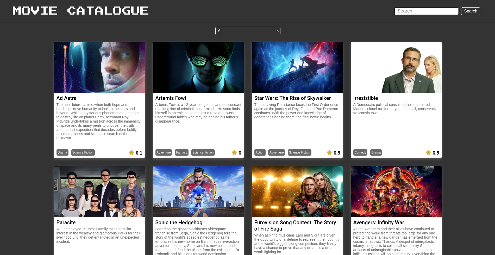
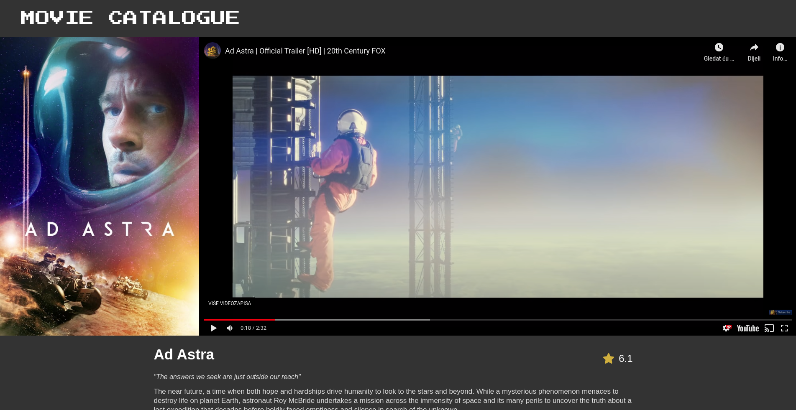
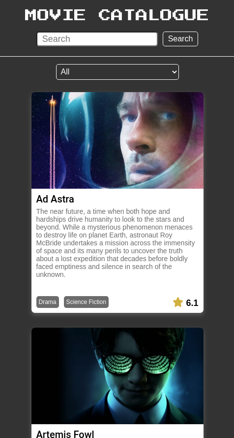

### React Movie Catalogue

> Microverse description - Catalogue of Dog Clothes

## Table of Contents

* [About the Project](#about-the-project)
  * [Built With](#built-with)
* [Setup](#setup)
* [Author](#author)
* [Show your Support](#show-your-support)
* [Acknowledgements](#acknowledgements)

<!-- ABOUT THE PROJECT -->
## About The Project

### Home

<p align="center">
  
</p>

### Movie details

<p align="center">
  
</p>

### Mobile

<p align="center">
  
</p>

The project is based on a catalogue of clothes for dogs. That was the base idea for the project.
The original theme was just an example, for this project I needed to create a React and Redux SPA - that had a home page for browsing through the catalogue items, and a details page for one of the catalogue items.

For this project I decided to use the [TMDB - API](https://www.themoviedb.org/) to create a Movie Catalogue.

On the Home page, when you first enter the app, you can see a list of todays most popular movies. Through there you can either open one of the listed movies, or search for a different movie. 

Live version of the project: [Live version](https://movie-catalogue.netlify.app/)

Project Link: [React-Movie-Catalogue](https://github.com/ermin-cahtarevic/react-movie-catalogue)


### Built With

*   React
*   Redux
*   [TMBD - API](https://www.themoviedb.org/)
*   npm
*   CSS
*   ES6

## Setup

```
git clone git@github.com:ermin-cahtarevic/react-movie-catalogue.git
```
### Install dependencies

```
npm install
```

### Start Development Server

```
npm start
```
### Visit this link in your browser
```
http://localhost:3000/
```

### Run ESlint

```
npx eslint .
```
### Run Stylelint

```
npx stylelint "**/*.{css,scss}"
```

### Run tests

```
npm test
```

<!-- CONTACT -->
## Author

- Github: [@ermin-cahtarevic](https://github.com/ermin-cahtarevic)
- Twitter: [@ErminCahtarevic](https://twitter.com/ErminCahtarevic)
- Linkedin: [Ermin Cahtarevic](https://www.linkedin.com/in/ermincahtarevic/)

<!-- ABOUT THE PROJECT-->
## Show your support

Give a star if you like this project!

<!-- ACKNOWLEDGEMENTS -->
## Acknowledgements

* [Microverse](https://www.microverse.org/)
* [TMBD - API](https://www.themoviedb.org/)
